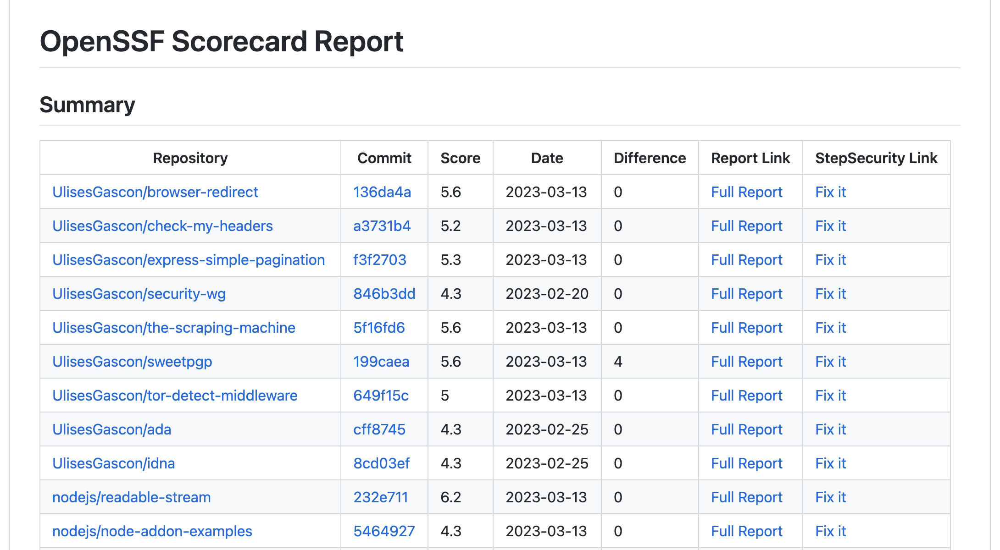
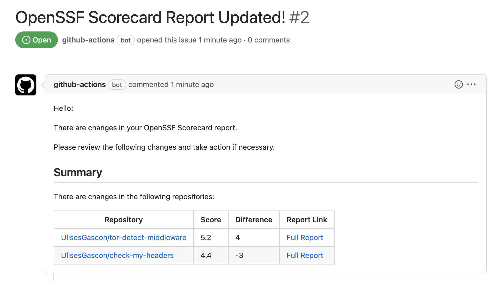

# OpenSSF Scorecard Monitor

**Simplify OpenSSF Scorecard tracking in your organization with automated markdown and JSON reports, plus optional GitHub issue alerts.**

## 🔮 About

If you're feeling overwhelmed by an avalanche of repository scorecards in your organization, you can breathe easy: Automation is here to make your life easier! It will streamline the process of keeping track of them all by providing a comprehensive report in Markdown and a local database in JSON with all the scores. Furthermore, to stay on top of any changes in the scores, you can choose to get notifications through Github Issues.

## 📺 Tutorial

_soon_

## ❤️ Awesome Features

- Easy to use with great customization
- Easy to patch the scoring as the reports includes a direct link to [StepSecurity](https://app.stepsecurity.io)
- Easy way to visualize the scorecard results with [The Scorecard Visualizer](https://kooltheba.github.io/openssf-scorecard-api-visualizer/#/projects/github.com/nodejs/node) or [deps.dev](https://deps.dev/project/github/nodejs%2Fnode)
- Discovery mode: list all the repos in one or many organizations that are tracked in the OpenSSF Scorecard
- Reporting in Markdown with essential information (hash, date, score) and comparative against the prior score.
- Self-hosted: The reporting data is stored in json format (including previous records) in the repo itself.
- Generate an issue (assignation, labels..) with the last changes in the scores, including links to the full report.
- Easy to exclude/include new repositories in the scope from any github organization
- Extend the markdown template with you own content by using tags
- Easy to modify the files and ensure the integrity with Json Schemas
- The report data is exported as an output and can be used in the pipeline
- Great test coverage (in progress)

### 🎉 Demo

**Sample Report**



_[Sample report](https://github.com/nodejs/security-wg/blob/main/tools/ossf_scorecard/report.md)_

**Sample Issue**



_[Sample issue](https://github.com/nodejs/security-wg/issues/885)_

## :shipit: Used By

- [Nodejs](https://github.com/nodejs): The Node.js Ecosystem Security Working Group is using [this pipeline](https://github.com/nodejs/security-wg/blob/main/.github/workflows/ossf-scorecard-reporting.yml) to generate a [report](https://github.com/nodejs/security-wg/blob/main/tools/ossf_scorecard/report.md) with scores for all the repositories in the Node.js org.
- [One Beyond](https://github.com/onebeyond): The Maintainers are using [this pipeline](https://github.com/onebeyond/maintainers/blob/main/.github/workflows/security-scoring.yml) to generate a scoring report inside [a specific document](https://github.com/onebeyond/maintainers/blob/main/docs/reporting/scorecard.md), in order to generate a [web version](https://onebeyond-maintainers.netlify.app/reporting/osff-scorecard) of it
- [NodeSecure](https://github.com/NodeSecure): The Maintainers are using [this pipeline](https://github.com/NodeSecure/Governance/blob/main/.github/workflows/ossf-scorecard-reporting.yml) to generate a scoring report and notification issues.
- **[More users](https://github.com/UlisesGascon/openssf-scorecard-monitor/network/dependents)**

## 📡 Usage

### Standalone with auto discovery version

With this workflow you get them most of this action:
- Trigger manual or by Cron job every Sunday
- It will scan the org(s) in scope looking for repositories that are available in the OpenSSF Scorecard
- It will store the database and the scope files in the repo
- It will generate an issue if there are changes in the score

```yml
name: "OpenSSF Scoring"
on: 
  # Scheduled trigger
  schedule:
    # Run every Sunday at 00:00
    - cron: "0 0 * * 0"
  # Manual trigger
  workflow_dispatch:

permissions:
  # Write access in order to update the local files with the reports
  contents: write
  pull-requests: none 
  # Write access in order to create issues
  issues: write
  packages: none

jobs:
  security-scoring:
    runs-on: ubuntu-latest
    steps:
      - uses: actions/checkout@v2
      - name: OpenSSF Scorecard Monitor
        uses: UlisesGascon/openssf-scorecard-monitor@v2.0.0-beta5
        with:
          scope: reporting/scope.json
          database: reporting/database.json
          report: reporting/openssf-scorecard-report.md
          auto-commit: true
          auto-push: true
          generate-issue: true
          # The token is needed to create issues, discovery mode and pushing changes in files
          github-token: ${{ secrets.GITHUB_TOKEN }}
          discovery-enabled: true
          # As an example nodejs Org and Myself
          discovery-orgs: 'UlisesGascon,nodejs'
```

### Options

- `scope`: Defines the path to the file where the scope is defined
- `database`: Defines the path to the json file usage to store the scores and compare
- `report`: Defines the path where the markdown report will be added/updated
- `auto-commit`: Commits the changes in the `database` and `report` files
- `auto-push`: Pushes the code changes to the branch
- `generate-issue`: Creates an issue with the scores that had been updated
- `issue-title`: Defines the issue title
- `issue-assignees`: List of assignees for the issue
- `issue-labels`: List of labels for the issue
- `github-token`: The token usage to create the issue and push the code
- `max-request-in-parallel`: Defines the total HTTP Request that can be done in parallel
- `discovery-enabled`: Defined if the discovery is enabled
- `discovery-orgs`: List of organizations to be includes in the discovery, example: `discovery-orgs: owasp,nodejs`. The OpenSSF Scorecard API is case sensitive, please use the same organization name as in the github url, like: https://github.com/NodeSecure is `NodeSecure` and not `nodesecure`. [See example](https://github.com/NodeSecure/Governance/issues/21#issuecomment-1474770986)
- `report-tags-enabled`: Defines if the markdown report must be created/updated around tags by default is disabled. This is useful if the report is going to be include in a file that has other content on it, like docusaurus docs site or similar
- `report-start-tag` Defines the start tag, default `<!-- OPENSSF-SCORECARD-MONITOR:START -->`
- `report-end-tag`: Defines the closing tag, default `<!-- OPENSSF-SCORECARD-MONITOR:END -->`
- `render-badge`: Defines if the OpenSSF badge must be rendered in the reportor to only show the score
- `report-tool`: Defines the reporting review tool in place: `scorecard-visualizer` [Example](https://kooltheba.github.io/openssf-scorecard-api-visualizer/#/projects/github.com/nodejs/node) or `deps.dev` [Example](https://deps.dev/project/github/nodejs%2Fnode), by default `scorecard-visualizer`

### Outputs

- `scores`: Score data in JSON format

```yml
name: "OpenSSF Scoring"
on: 
  # ...

permissions:
  # ...

jobs:
  security-scoring:
    runs-on: ubuntu-latest
    steps:
      - uses: actions/checkout@v2
      - name: OpenSSF Scorecard Monitor
        uses: UlisesGascon/openssf-scorecard-monitor@v2.0.0-beta5
        id: openssf-scorecard-monitor
        with:
          # ....
      - name: Print the scores
        run: |
          echo '${{ steps.openssf-scorecard-monitor.outputs.scores }}'  
```

## 🚀 Advance Tips

### Avoid commit directly in the branch and generate a PR 

If you have the OpenSSF Scorecard recommended branch protection rules in place, it will be impossible to commit and push directly to the `main` branch. An easy alternative is to extend the pipeline to generate a PR for you:

```yml
name: "OpenSSF Scoring"
on: 
  # ...

permissions:
  contents: write
  pull-requests: write
  issues: write
  packages: none

jobs:
  security-scoring:
    runs-on: ubuntu-latest
    steps:
      - uses: actions/checkout@v2
      - name: OpenSSF Scorecard Monitor
        uses: UlisesGascon/openssf-scorecard-monitor@v2.0.0-beta5
        id: openssf-scorecard-monitor
        with:
          auto-commit: false
          auto-push: false
          generate-issue: true
          # ....
      - name: Print the scores
        run: |
          echo '${{ steps.openssf-scorecard-monitor.outputs.scores }}'
      - name: Create Pull Request
        uses: peter-evans/create-pull-request@38e0b6e68b4c852a5500a94740f0e535e0d7ba54 # v4.2.4
        with:
            token: ${{ secrets.GITHUB_TOKEN }}
            commit-message: OpenSSF Scorecard Report Updated
            title: OpenSSF Scorecard Report Updated
            body: OpenSSF Scorecard Report Updated
            base: main
            assignees: ${{ github.actor }}
            branch: openssf-scorecard-report-updated
            delete-branch: true
``` 

### Embed Report version

If you want to mix the report in markdown format with other content, then you can use `report-tags-enabled=true` then report file will use the tags to add/update the report summary without affecting what is before or after the tagged section.

This is very useful for static websites, here is [an example using docusaurus](https://github.com/onebeyond/maintainers/blob/main/docs/reporting/scorecard.md).

### Custom tags

By default we use `<!-- OPENSSF-SCORECARD-MONITOR:START -->` and `<!-- OPENSSF-SCORECARD-MONITOR:END -->`, but this can be customize by adding your custom tags as `report-start-tag` and `report-end-tag`

### Increase HTTP request in parallel

You can control the amount of parallel requests performed against the OpenSSF Scorecard Api by defining any numerical value in `max-request-in-parallel`, like `max-request-in-parallel=15`.

By default the value is 10, higher values might not be a good use of the API and you can hit some limits, please check with OpenSSF if you want to rise the limits safely.

### Exclude repos

In some scenarios we want to enable the auto-discovery mode but we want to ignore certain repos, the best way to achieve that is by editing the `scope.json` file and add any report that you want to ignore in the `excluded` section for that specific organization.

## 🍿 Other

### Scoping Structure

Just for reference, the scope will be stored this way:

File: `reporting/scope.json`

```json
{
    "github.com": {
      "included": {
        "UlisesGascon":[
          "tor-detect-middleware", 
          "check-my-headers", 
          "express-simple-pagination"
        ]
      },
      "excluded": {
        "UlisesGascon": [
          "demo-stuff"
        ]
      }
    }

}
```


### Database structure

Just for reference, the database will store the current value and previous values with the date:

```json
{
  "github.com": {
    "UlisesGascon": {
      "check-my-headers": {
        "previous": [ {
          "score": 6.7,
          "date": "2022-08-21"
        }],
        "current": {
          "score": 4.4,
          "date": "2022-11-28"
        }
      }
    }
  }
}
```
